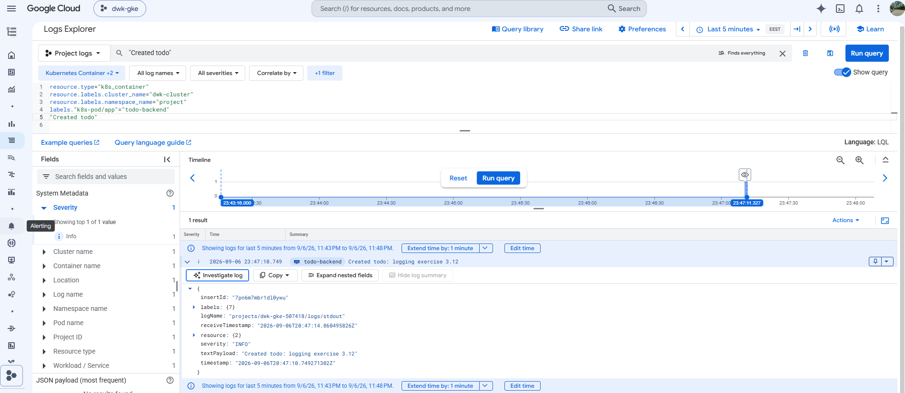

# K8sSubmissions

## Exercises

[Exercise 1.1](https://github.com/OtsoH/K8sSubmissions/tree/1.1)

[Exercise 1.2](https://github.com/OtsoH/K8sSubmissions/tree/1.2)

[Exercise 1.3](https://github.com/OtsoH/K8sSubmissions/tree/1.3)

[Exercise 1.4](https://github.com/OtsoH/K8sSubmissions/tree/1.4)

[Exercise 1.5](https://github.com/OtsoH/K8sSubmissions/tree/1.5)

[Exercise 1.6](https://github.com/OtsoH/K8sSubmissions/tree/1.6)

[Exercise 1.7](https://github.com/OtsoH/K8sSubmissions/tree/1.7)

[Exercise 1.8](https://github.com/OtsoH/K8sSubmissions/tree/1.8)

[Exercise 1.9](https://github.com/OtsoH/K8sSubmissions/tree/1.9)

[Exercise 1.10](https://github.com/OtsoH/K8sSubmissions/tree/1.10)

[Exercise 1.11](https://github.com/OtsoH/K8sSubmissions/tree/1.11)

[Exercise 1.12](https://github.com/OtsoH/K8sSubmissions/tree/1.12)

[Exercise 1.13](https://github.com/OtsoH/K8sSubmissions/tree/1.13)

[Exercise 2.1](https://github.com/OtsoH/K8sSubmissions/tree/2.1)

[Exercise 2.2](https://github.com/OtsoH/K8sSubmissions/tree/2.2)

[Exercise 2.3](https://github.com/OtsoH/K8sSubmissions/tree/2.3)

[Exercise 2.4](https://github.com/OtsoH/K8sSubmissions/tree/2.4)

[Exercise 2.5](https://github.com/OtsoH/K8sSubmissions/tree/2.5)

[Exercise 2.6](https://github.com/OtsoH/K8sSubmissions/tree/2.6)

[Exercise 2.7](https://github.com/OtsoH/K8sSubmissions/tree/2.7)

[Exercise 2.8](https://github.com/OtsoH/K8sSubmissions/tree/2.8)

[Exercise 2.9](https://github.com/OtsoH/K8sSubmissions/tree/2.9)

[Exercise 2.10](https://github.com/OtsoH/K8sSubmissions/tree/2.10)

[Exercise 3.1](https://github.com/OtsoH/K8sSubmissions/tree/3.1)

[Exercise 3.2](https://github.com/OtsoH/K8sSubmissions/tree/3.2)

[Exercise 3.3](https://github.com/OtsoH/K8sSubmissions/tree/3.3)

[Exercise 3.4](https://github.com/OtsoH/K8sSubmissions/tree/3.4)

[Exercise 3.5](https://github.com/OtsoH/K8sSubmissions/tree/3.5)

[Exercise 3.6](https://github.com/OtsoH/K8sSubmissions/tree/3.6)

[Exercise 3.7](https://github.com/OtsoH/K8sSubmissions/tree/3.7)

[Exercise 3.8](https://github.com/OtsoH/K8sSubmissions/tree/3.8)

[Exercise 3.9](https://github.com/OtsoH/K8sSubmissions/tree/3.9)

## Exercise 3.9: DBaaS vs DIY

### Database as a service

- Pros:
  - Setup is a form and a wait, with no StatefulSet, PVC or Secret to write.
  - Patching, minor upgrades and monitoring are the provider's job.
  - Storage grows on its own instead of a full disk stopping writes.
  - Daily backups and point in time recovery come turned on, and restoring is one command.
  - HA and read replicas are a checkbox rather than something you build.
  - The instance outlives the cluster, so recreating the cluster does not touch the data.
- Cons:
  - It is billed per hour whether or not anything queries it, and HA roughly doubles that.
  - Deleting the cluster does not stop the billing, so the instance has to be stopped separately.
  - Connectivity is real work: private IP with VPC peering or the auth proxy as a sidecar.
  - Maintenance windows restart the instance on the provider's schedule, not yours.
  - There is no local equivalent, so development stops matching production.
  - Configuration lives in the cloud console instead of the manifests in your repo.

### Own Postgres on a PersistentVolumeClaim

- Pros:
  - Around fifty lines of YAML, and the same manifests run in k3d and in the cloud.
  - You only pay for the disk, on nodes you are already paying for.
  - The PVC outlives the StatefulSet, so deleting and redeploying the app keeps the data.
  - Version, extensions and configuration are yours, with nothing to migrate if you change clouds.
- Cons:
  - Backups start at nothing, so volume snapshots or a pg_dump CronJob are yours to build.
  - Nobody tests your restore procedure until you need it.
  - Point in time recovery is not realistically on the table.
  - One replica on a ReadWriteOnce zonal disk is a single point of failure pinned to one zone.
  - Every node drain is downtime while the pod reschedules and the disk reattaches.
  - Major version upgrades are pg_upgrade or a dump and restore, by hand, with downtime.
  - Running out of disk stops writes, and volumeClaimTemplates is immutable once the StatefulSet exists.
  - Patching, metrics and alerting are yours to set up.
  - Deleting the cluster leaves the disk behind, still billing but no longer a usable PVC.

For a small project whose data can be regenerated, DIY wins on cost and on keeping local and cloud identical. Once losing the data would actually hurt, buying backups and failover is cheaper than building them.

[Exercise 3.10](https://github.com/OtsoH/K8sSubmissions/tree/3.10)

[Exercise 3.11](https://github.com/OtsoH/K8sSubmissions/tree/3.11)

[Exercise 3.12](https://github.com/OtsoH/K8sSubmissions/tree/3.12)

[Exercise 4.1](https://github.com/OtsoH/K8sSubmissions/tree/4.1)

[Exercise 4.2](https://github.com/OtsoH/K8sSubmissions/tree/4.2)
